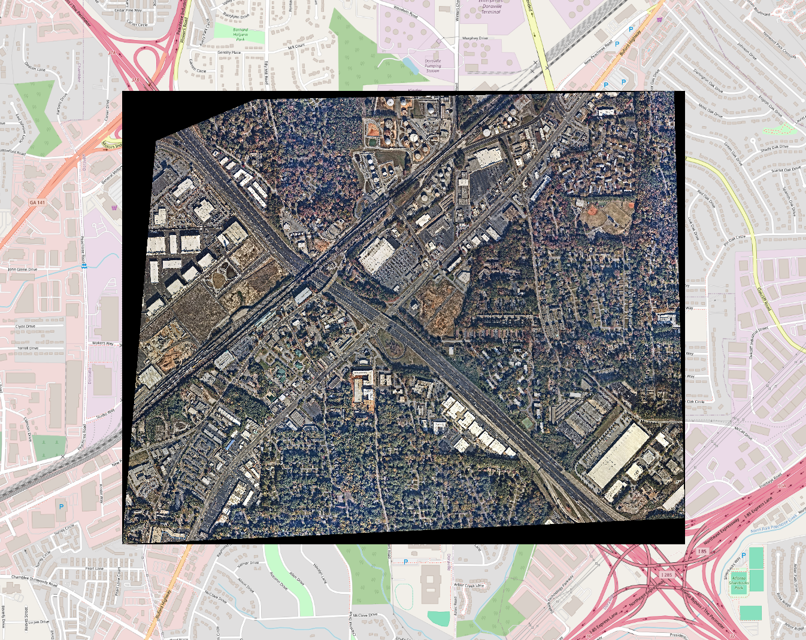
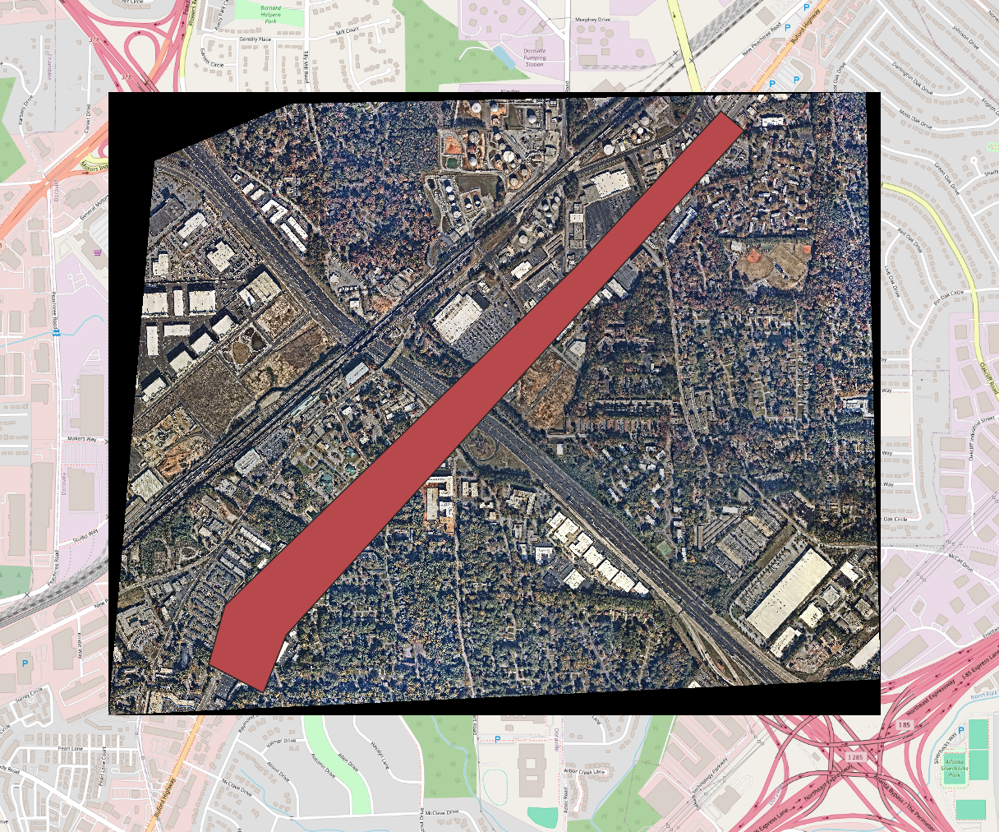
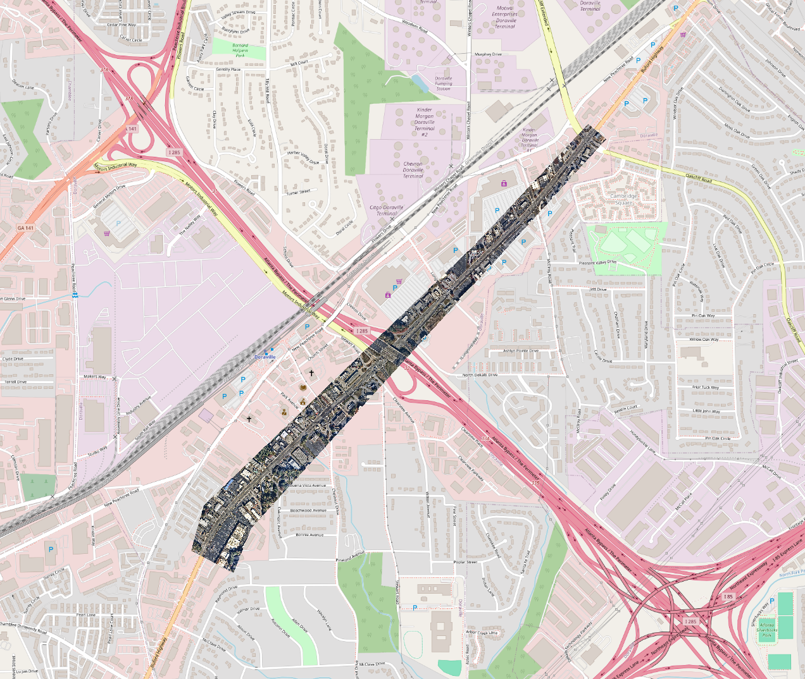

# GeoTIFF Merging and Clipping Tool

This Python project provides tools to merge multiple GeoTIFF files into a single file and clip the merged GeoTIFF using a boundary defined in a GeoJSON file.

## Features
- **Merge GeoTIFFs**: Combine multiple GeoTIFF files into a single GeoTIFF.
- **Clip GeoTIFF**: Use a GeoJSON file to define a clipping boundary and crop the GeoTIFF to those extents.

---

## Prerequisites

1. **Python**:
   - Ensure Python is installed on your system (3.8 or later recommended).

2. **GDAL**:
   - Install GDAL for Python. You can install it via pip:
     ```bash
     pip install gdal
     ```

3. **Input Data**:
   - A folder containing GeoTIFF files for merging.
   - A GeoJSON file defining the clipping boundary.

---

## Installation
-  Clone the repository:
   ```bash
   git clone
    ```
-  Install the required packages using pip or conda. 

---

## Usage

1. Run Merge to merge any tiled images from Nearmap or from download via api. (this may or may not be necessary depending
on the format of the starting data.)
   
2. Run Clip to clip the merged image to the desired boundary.

Images Examples: 
1. Merged Image (before clipping) 


2. Merged Image (before with clipping shape overlaid) 


3. Merged Image (after clipping) 



